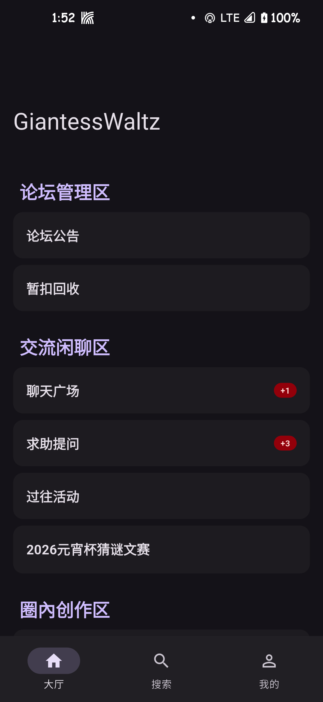
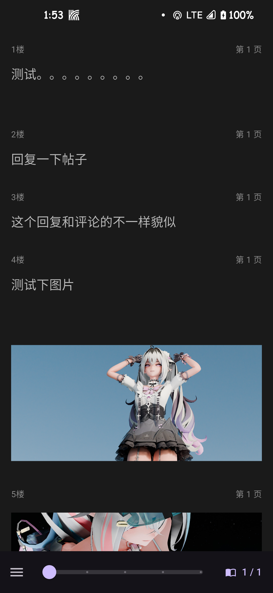

# GiantessWaltz Flutter Client

一个为 **GiantessWaltz (GW论坛)** 量身定制的第三方移动客户端。采用 Flutter 开发，旨在提供远超手机网页版的流畅阅读体验与强大的离线功能。

## 🌟 项目亮点

这个项目最初由 AI 辅助构建，并针对 Discuz! X3.4 架构进行了深度定制和改构。它不仅仅是一个网页套壳，而是一个**原生 API 驱动**的高性能应用。

### 🚀 核心特性

- **极致速度 (API-First)**：全面弃用传统的网页爬虫，直接对接 Discuz! 移动端 JSON API。解析速度提升数倍，流量节省 60% 以上。
- **全本离线下载**：支持一键“离线整本”。App 会自动批量获取所有页面的 JSON 数据并存储在本地持久化目录（Documents），支持完全断网下的顺滑阅读。
- **沉浸式“小说模式”**：
    - 自动识别并锁定楼主 ID。
    - 智能清洗 HTML 样式，提供纯净的排版。
    - 支持“羊皮纸”、“夜间”、“豆沙绿”等多种阅读背景。
    - 字体大小动态调节。
- **高级回复系统**：
    - **智能嗅探**：后台自动嗅探网页版高级回复的 `hash` 参数。
    - **图片压缩**：上传前自动进行智能压缩，解决服务器 413 (Payload Too Large) 限制，大幅提升上传成功率。
    - **附件支持**：支持插入 `[attachimg]` 标签，发帖体验原生化。
- **个性化定制**：
    - **全局壁纸**：支持从相册选择图片作为背景，并自动持久化存储。
    - **透明美化**：支持顶栏与底栏透明，与自定义壁纸完美融合。
- **阅读记忆**：精准记录读到的楼层与页码，支持 PID 级别的跳转。

## 🛠️ 技术栈

- **框架**: Flutter (Dart)
- **网络**: [Dio](https://pub.dev/packages/dio) (拦截器处理 Cookie 持久化)
- **渲染**: [flutter_widget_from_html](https://pub.dev/packages/flutter_widget_from_html) (高性能 HTML 渲染)
- **存储**: [SharedPreferences](https://pub.dev/packages/shared_preferences) (配置) + [path_provider](https://pub.dev/packages/path_provider) (离线文件)
- **组件**: [scroll_to_index](https://pub.dev/packages/scroll_to_index) (精准楼层定位)

## 📸 应用截图

<!-- 这里使用的是相对路径，请确保你的图片文件在 picture 文件夹下，且文件名对应 -->
| 首页浏览 | 小说模式 | 图片预览 | 个人中心 |
|:---:|:---:|:---:|:---:|
|  |  |  |  |

## 📥 下载安装

前往 [Releases](../../releases) 页面下载最新版本的 APK 安装包。

## 🔒 隐私声明

本应用为**开源、非官方**客户端。
- **账号安全**：所有登录操作直接在 GN 论坛原版网页 (WebView) 中进行，App 仅获取登录成功后的 Cookie 用于数据请求。
- **隐私保护**：App 不会收集或上传您的任何个人信息。
- **纯净无广**：本项目纯粹为爱发电，无任何广告植入。

## 🤝 反馈与交流

如果你在使用中遇到 Bug（比如闪退、解析错误），欢迎在 GitHub 提 [Issues](../../issues) 或在论坛发布页留言。

## 📄 开源协议

本项目遵循 [MIT License](LICENSE) 开源协议。

---
*Created with ❤️ by fangzny*
