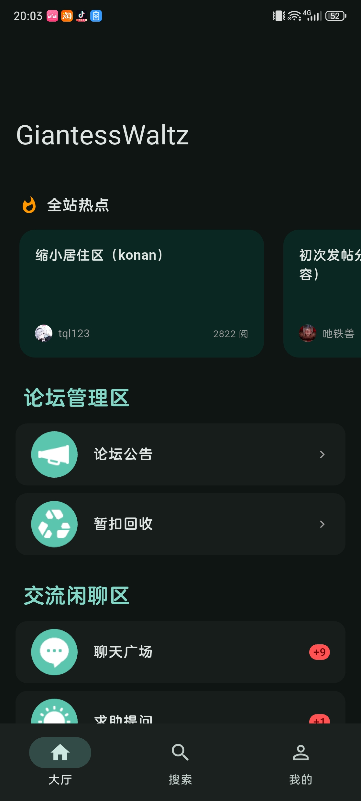
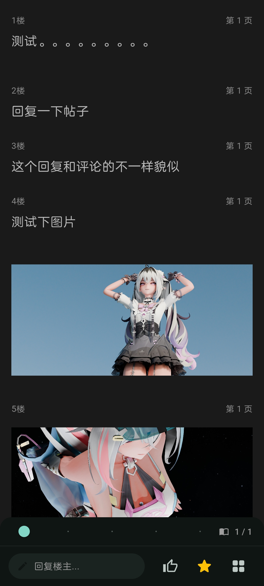
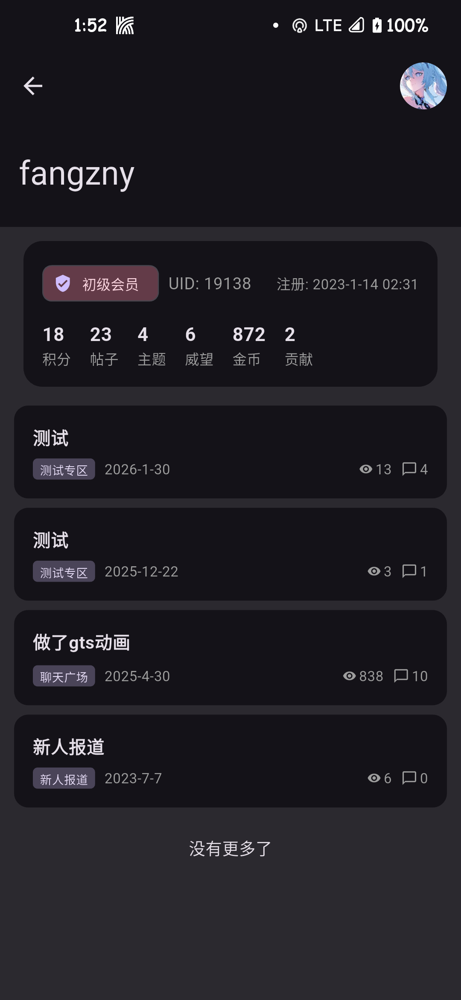

# GiantessWaltz Flutter Client

[简体中文](./README.md) | [English](./README_EN.md) 

> **声明 / Disclaimer**: 本项目完全免费开源。如果你是在闲鱼、淘宝等平台付费购买的，请立即退款并举报商家。
> This project is completely free and open source. If you paid for it, please request a refund immediately.

一个为 **GiantessWaltz (GW论坛)** 量身定制的第三方移动客户端。采用 Flutter 开发，旨在提供远超手机网页版的流畅阅读体验与强大的离线功能。

## 🌟 项目亮点 / Highlights

这个项目最初由 AI 辅助构建，并针对 Discuz! X3.4 架构进行了深度定制。它不仅仅是一个网页套壳，而是一个**原生 API 驱动**的高性能应用。

- **🚀 极致速度 (API-First)**：全面弃用网页爬虫，直接对接 Discuz! 移动端 JSON API。流量节省 60% 以上。
- **📦 全本离线下载**：支持一键“离线整本”。支持完全断网下的顺滑阅读。
- **📖 沉浸式“小说模式”**：智能锁定楼主、纯净排版、多种背景色方案。
- **💬 高级回复系统**：支持图片智能压缩上传、BBCode 工具栏、发帖前置检测。
- **🎨 个性化定制**：支持自定义全局壁纸、透明主题适配。

## 📸 应用截图 / Screenshots

| 首页大厅 | 小说模式 | 图片预览 | 个人中心 |
|:---:|:---:|:---:|:---:|
|  |  |  |  |

## 📥 下载安装 / Installation

1.  前往 [Releases](../../releases) 页面。
2.  下载最新的 `app-release.apk`。
3.  在安卓设备上安装即可使用。

## 🛠️ 技术栈 / Tech Stack

- **Framework**: Flutter (Dart)
- **Networking**: [Dio](https://pub.dev/packages/dio) (With Cookie persistence)
- **HTML Rendering**: [flutter_widget_from_html](https://pub.dev/packages/flutter_widget_from_html)
- **Backend (Update Service)**: Python + FastAPI (Hosted on HF Spaces)

## 🔒 隐私与安全 / Privacy & Security

- **账号安全**：所有登录操作直接在官方原版网页中进行，App 仅获取登录成功后的 Cookie。
- **隐私保护**：App 不会收集或上传您的任何个人隐私信息。
- **纯净无广**：本项目纯粹为爱发电，永久无广告。

## 🤝 反馈与贡献 / Feedback

- 如果在使用中遇到 Bug，欢迎提交 [Issues](../../issues)。
- 欢迎感兴趣的开发者提交 Pull Request 共同优化。
## DEEPWIKI

---
*Created with ❤️ by [fangzny](https://github.com/fangzny1)*